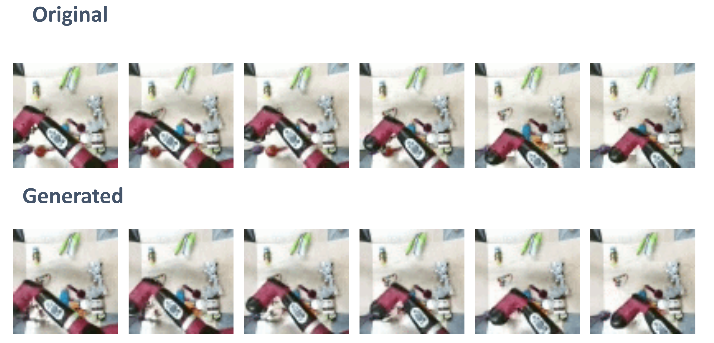
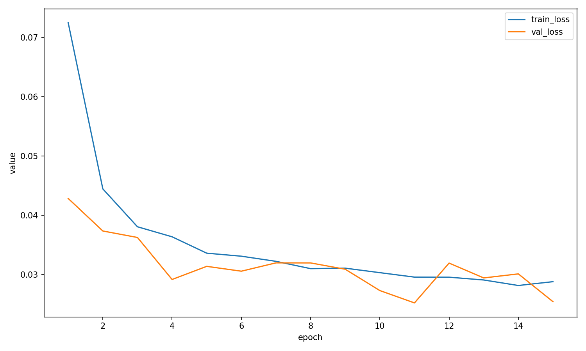

# Lightweight Endpoint-Context RGB Video Diffusion (PyTorch)

<p align="center">
  
</p>

*Top: Ground truth BAIR frames. Bottom: Generated middle frames conditioned on start and end frames.*
---

## Objective

This repository implements a lightweight **endpoint-conditioned video diffusion model** for generating the middle portion of a short video clip given observed start and end frames.

The training objective models:

[
p(\text{frames}_{K..T-K-1} \mid \text{first }K\text{ frames},\ \text{last }K\text{ frames})
]

Default configuration:

```
K = 2
```

(`--endpoint_context 2`)

Example for `T = 8`:

```
Observed start:  [0,1]
Observed end:    [6,7]
Generated:       [2,3,4,5]
```

The model therefore learns **motion interpolation under fixed temporal boundary conditions**.

---

# Training Data

The model is trained on **BAIR Robot Pushing video sequences** stored as **MP4 files**.

The dataset directory is expected to contain many short MP4 clips. The loader recursively scans the dataset directory and automatically constructs the train/validation splits.

Example structure:

```
data/
  videos_train/
      00001.mp4
      00002.mp4
      ...

  videos_val/
      10001.mp4
      10002.mp4
```

Each MP4 is decoded into fixed-length clips during training.

Returned tensor format:

```
clip: [C, T, H, W]
```

Where:

```
C = 3 (RGB default)
T = number of frames
H,W = spatial resolution
```

Grayscale mode is supported with:

```
--color_mode gray
```

---

# Active Task: Middle Frame Generation

The model performs **endpoint-conditioned temporal interpolation**.

For clip length `T` and context length `K`:

```
start_context  = clip[:, :, :K]
middle_target  = clip[:, :, K:-K]
end_context    = clip[:, :, -K:]
```

Constraint:

```
T > 2K
```

Observed context frames are **never denoised or regenerated**.

Generated outputs are assembled as:

```
[exact_start_context, generated_middle..., exact_end_context]
```

This prevents endpoint drift and stabilizes training.

---

# Repository Structure

```
video_diffusion/

train_video_ddpm.py
sample_video_ddpm.py

models/
    video_unet3d.py
    conditioning_encoder.py

    blocks/
        resnet3d.py
        attention3d.py

    modules/
        film.py
        temporal_attention.py

diffusion/
    schedule.py

data/
    kinetics_video_dataset.py

utils/
    io.py
    video_utils.py
```

---

# Key Components

**train_video_ddpm.py**

Main training script implementing:

* DDPM training
* EMA model tracking
* preview generation
* checkpointing

**sample_video_ddpm.py**

Inference script generating missing middle frames conditioned on endpoint contexts.

**models/video_unet3d.py**

Core **3D U-Net diffusion denoiser** operating directly in pixel space.

**models/conditioning_encoder.py**

Shared encoder that extracts multiscale conditioning features from start and end context clips.

**diffusion/schedule.py**

Noise schedule utilities supporting DDPM training and DDIM sampling.

**data/kinetics_video_dataset.py**

Dataset loader that discovers MP4 files and produces fixed-length training clips.

**utils/io.py**

Utilities for saving preview frames and MP4 videos.

---

# Model Architecture

The repository uses a compact **pixel-space RGB video diffusion model**.

Core components:

* 3D U-Net denoiser
* shared multiscale conditioning encoder
* endpoint feature fusion
* FiLM modulation
* temporal attention

### Conditioning Pipeline

Both endpoint contexts are encoded:

```
start_context -> conditioning encoder
end_context   -> conditioning encoder
```

Feature fusion:

```
concat -> 1x1 projection
```

Conditioning modulates the denoiser through **FiLM layers** across:

* input stem
* down blocks
* bottleneck
* up blocks

Temporal attention enforces motion consistency.

---

# Diffusion Training

Training uses **pixel-space DDPM** with optional **DDIM sampling**.

Features:

* EMA weight averaging
* classifier-free guidance
* temporal loss weighting
* AMP mixed precision

## Training Behavior

<p align="center">
  
</p>

*Training and validation loss curves during BAIR training. Both losses decrease steadily and remain closely aligned, indicating stable convergence without significant overfitting.*

---
# Default Training Configuration

Designed for single GPU experiments.

```
size = 64
T = 8
endpoint_context = 2
frame_stride = 1

base_channels = 96
channel_mults = 1 2 4
res_blocks = 2

temporal_attn_levels = 1 2

cfg_drop_prob = 0.08

temporal_loss_weight = 0.05

noise_offset = 0.0

dynamic_threshold = False

color_mode = rgb
```

---

# Commands

## Overfit sanity check

```
python train_video_ddpm.py \
  --data_root /path/to/data_root \
  --out_dir ./outputs/overfit_motion_ctx2 \
  --max_videos 64 \
  --size 64 \
  --T 8 \
  --endpoint_context 2 \
  --frame_stride 1 \
  --color_mode rgb \
  --batch_size 2 \
  --epochs 20 \
  --max_steps 500 \
  --base_channels 96 \
  --channel_mults 1 2 4 \
  --temporal_attn_levels 1 2 \
  --cfg_drop_prob 0.08 \
  --temporal_loss_weight 0.05 \
  --vis_every 1 \
  --num_workers 2
```

## Full training

```
python train_video_ddpm.py \
  --data_root /path/to/data_root \
  --out_dir ./outputs/train_motion_ctx2 \
  --size 64 \
  --T 8 \
  --endpoint_context 2 \
  --frame_stride 1 \
  --color_mode rgb \
  --batch_size 8 \
  --epochs 30 \
  --num_workers 4 \
  --lr 1e-4 \
  --base_channels 96 \
  --channel_mults 1 2 4 \
  --temporal_attn_levels 1 2 \
  --cfg_drop_prob 0.08 \
  --temporal_loss_weight 0.05 \
  --vis_every 1 \
  --amp
```

## Resume training

```
python train_video_ddpm.py \
  --data_root /path/to/data_root \
  --out_dir ./outputs/train_motion_ctx2 \
  --resume
```

## Video sampling

```
python sample_video_ddpm.py \
  --ckpt ./outputs/train_motion_ctx2/last.pt \
  --start_images ./start_0.png ./start_1.png \
  --end_images ./end_0.png ./end_1.png \
  --endpoint_context 2 \
  --color_mode rgb \
  --out_dir ./outputs/sample_motion_ctx2 \
  --steps 40 \
  --eta 0.0 \
  --guidance_scale 1.8 \
  --device cuda
```

Alternatively omit explicit images and sample contexts from dataset videos.

---

# Limitations

* Short temporal horizon
* Limited scene diversity
* Complex camera motion remains difficult

This repository is intended as a **clean research baseline for endpoint-conditioned video diffusion** rather than a full production video generation system.
